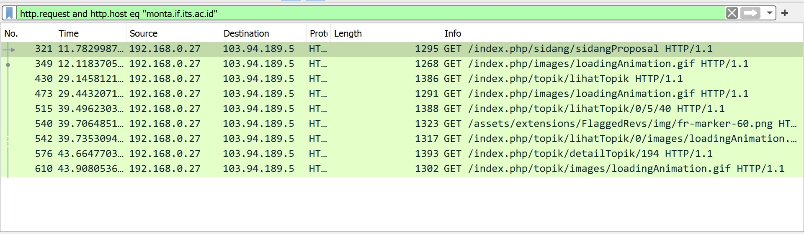
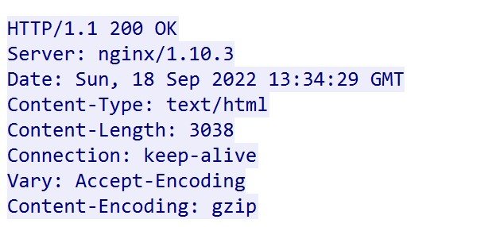
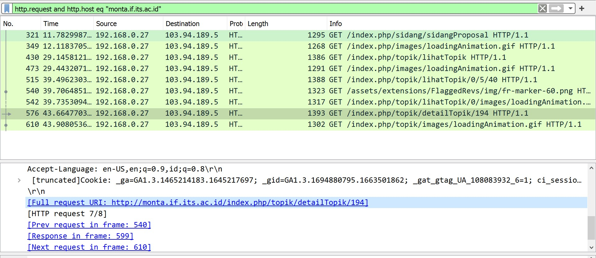
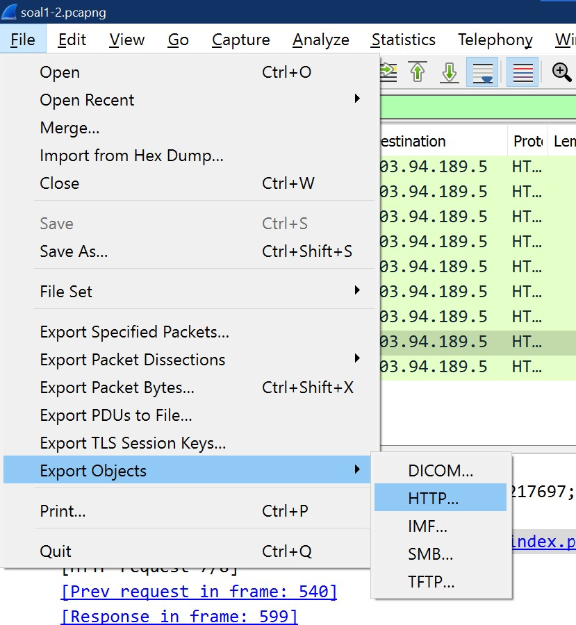
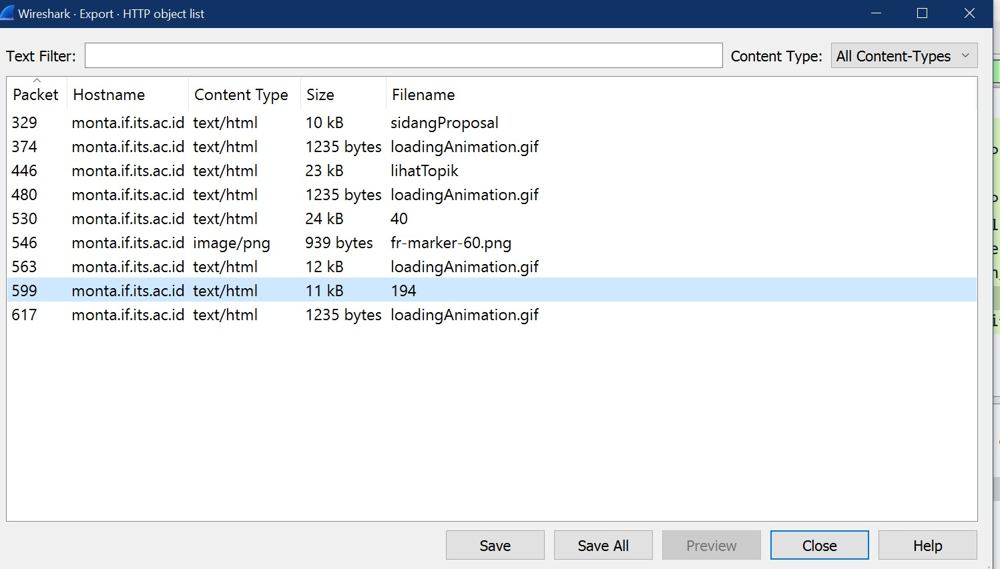
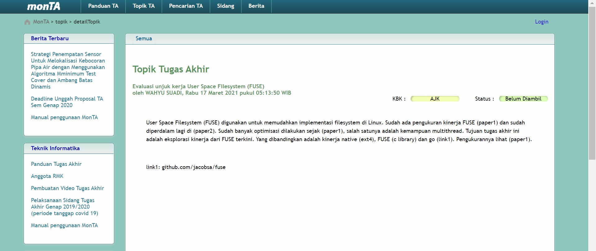
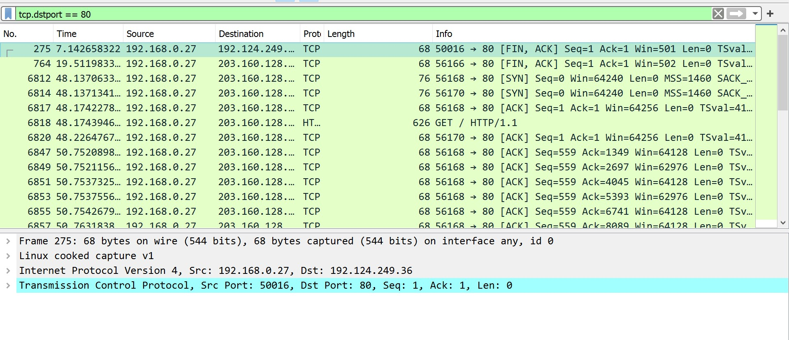
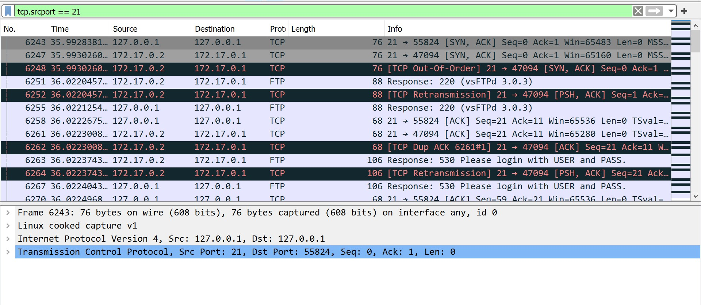
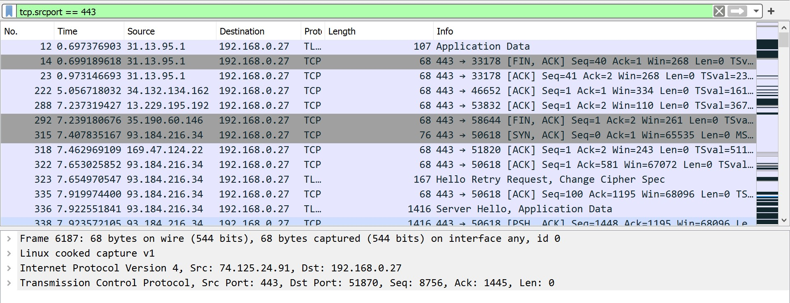

# Kelompok A05
* NRP - Nama
* NRP - Nama
* 5025201020 - Muhammad Ferdian Iqbal
  

### 1. Sebutkan web server yang digunakan pada "monta.if.its.ac.id"!

 

> Langkah pengerjaan 
- Tulis command **http.request and http.host eq "monta.if.its.ac.id"**
- Akan muncul informasi sebagai berikut

- Pada informasi tersebut, dipilih salah satu. Lalu, klik kanan, follow --> tcp stream. Akan muncul informasi web server yang digunakan

> Web server yang digunakan adalah **NginX**

 

### 2. Ishaq sedang bingung mencari topik ta untuk semester ini , lalu ia datang ke website monta dan menemukan detail topik pada website “monta.if.its.ac.id” , judul TA apa yang dibuka oleh ishaq?

 

> Langkah pengerjaan 
- Tulis command **http.request and http.host eq "monta.if.its.ac.id"**
- Akan muncul informasi sebagai berikut

- Terdapat request GET ke /index.php/topik/detailTopik/194

- Export object HTML untuk mendapatkan file

- Save file dengan nama 194 karena menurut request, file tersebut berisi detail topik

- Tambahkan ekstensi .html di belakang nama file dan buka filenya

> Judul TA = **Evaluasi unjuk kerja User Space Filesystem (FUSE)**

  

### 3. Filter sehingga wireshark hanya menampilkan paket yang menuju port 80!

 

> Langkah pengerjaan
- Ketikkan command **tcp.dstport == 80**

  

### 4. Filter sehingga wireshark hanya mengambil paket yang berasal dari port 21

 

> Langkah pengerjaan
- Ketikkan command **tcp.srcport == 21**

  

### 5. Filter sehingga wireshark hanya mengambil paket yang berasal dari port 443!

 

> Langkah pengerjaan
- Ketikkan command **tcp.srcport == 443**

  

### 6. Filter sehingga wireshark hanya menampilkan paket yang menuju ke lipi.go.id !