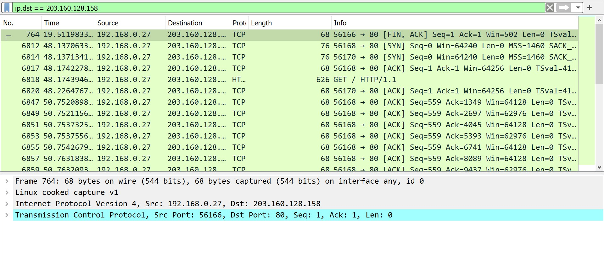
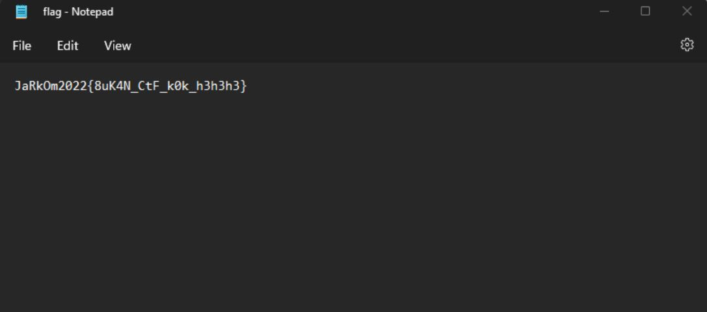

# Kelompok A05
* 5025201039 - Abd. Wahid
* 5025201197 - Abidjanna Zulfa Hamdika
* 5025201020 - Muhammad Ferdian Iqbal
  

### 1. Sebutkan web server yang digunakan pada "monta.if.its.ac.id"!

 

> Langkah pengerjaan 
- Tulis command **http.request and http.host eq "monta.if.its.ac.id"**
- Akan muncul informasi sebagai berikut

- Pada informasi tersebut, dipilih salah satu. Lalu, klik kanan, follow --> tcp stream. Akan muncul informasi web server yang digunakan

> Web server yang digunakan adalah **NginX**

 

### 2. Ishaq sedang bingung mencari topik ta untuk semester ini , lalu ia datang ke website monta dan menemukan detail topik pada website “monta.if.its.ac.id” , judul TA apa yang dibuka oleh ishaq?

 

> Langkah pengerjaan 
- Tulis command **http.request and http.host eq "monta.if.its.ac.id"**
- Akan muncul informasi sebagai berikut

- Terdapat request GET ke /index.php/topik/detailTopik/194

- Export object HTML untuk mendapatkan file

- Save file dengan nama 194 karena menurut request, file tersebut berisi detail topik

- Tambahkan ekstensi .html di belakang nama file dan buka filenya

> Judul TA = **Evaluasi unjuk kerja User Space Filesystem (FUSE)**

  

### 3. Filter sehingga wireshark hanya menampilkan paket yang menuju port 80!

 

> Langkah pengerjaan
- Ketikkan command **tcp.dstport == 80**

  

### 4. Filter sehingga wireshark hanya mengambil paket yang berasal dari port 21

 

> Langkah pengerjaan
- Ketikkan command **tcp.srcport == 21**

  

### 5. Filter sehingga wireshark hanya mengambil paket yang berasal dari port 443!

 

> Langkah pengerjaan
- Ketikkan command **tcp.srcport == 443**

  

### 6. Filter sehingga wireshark hanya menampilkan paket yang menuju ke lipi.go.id !

 

> Langkah pengerjaan
- Ping lipi.go.id, dapat IP 203.160.128.158

- Ketikkan command **ip.dst == 203.160.128.158**

  

### 7. Filter sehingga wireshark hanya mengambil paket yang berasal dari ip kalian!

 

> Langkah pengerjaan
- Cek ping devices terlebih dahulu

- Ketikkan command **ip.src == IP kalian**

  

### 8. Telusuri aliran paket dalam file .pcap yang diberikan, cari informasi berguna berupa percakapan antara dua mahasiswa terkait tindakan kecurangan pada kegiatan praktikum.

> Langkah pengerjaan
- Merujuk pada soal no 9 yang ada ekstensi des3 dengan ini kami mencari percakapan command frame matches “des3

- Follow TCP stream untuk melihat percakapan

- Detail percakapan adalah sebagai berikut

- Terlihat bahwa percakapan tersebut disimpan di stream 12. Untuk menemukan percakapan lain, perlu mengganti streamnya. 

- Percakapan kedua akhirnya ditemukan di stream 41

- Percakapan ketiga ditemukan di stream 90

- Total percakapan lengkap yang ditemukan ada 3, yaitu di stream 12, 41, dan 90

  

### 9. Terdapat laporan adanya pertukaran file yang dilakukan oleh kedua mahasiswa dalam percakapan yang diperoleh, carilah file yang dimaksud!

> Langkah pengerjaan
- Menurut percakapan di stream 12, pelaku akan mengirim file salt menggunakan port 9002. Maka kita perlu mencari file yang dikirimkan melalui port 9002. Ketikkan filter berikut **tcp.srcport==9002**

- Berdasarkan percakapan tersebut juga, file yang akan dikirimkan adalah file salt. Berdasarkan hasil yang ditemukan, hanya paket 61 yang berisikan file salt

- Export dan beri nama sesuai ketentuan serta tambahkan ekstensi des3. Nama file akan menjadi A05.des3. Decode file tersebut menggunakan password di nomor 10 dan akan keluar hasil file flag

- Detail isi dari file flag

  

### 10. Temukan password rahasia (flag) dari organisasi bawah tanah yang disebutkan di atas!

> Langkah pengerjaan
- Berdasarkan percakapan di stream 12, clue dari password adalah karakter anime yang kembar lima. Anime yang dimaksud adalah Gotoubun no Hanayome. Dalam anime tersebut, kembar 5 tersebut memiliki nama keluarga "nakano". "nakano" inilah yang menjadi password dari file tersebut. Password dipastikan benar berdasarkan file flag yang didapatkan di nomor 9

